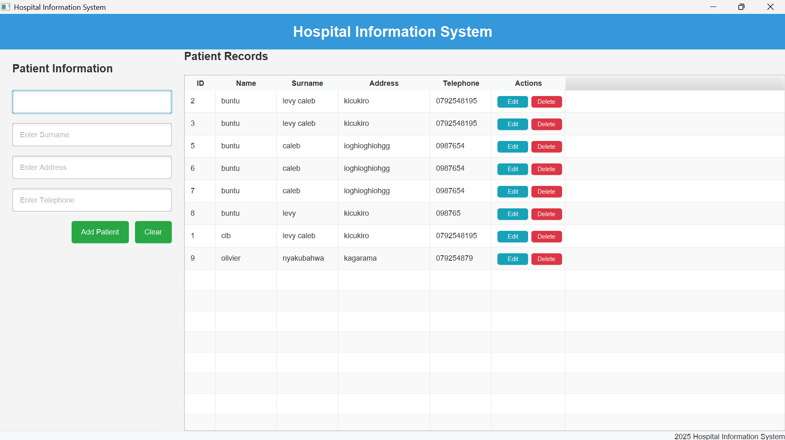
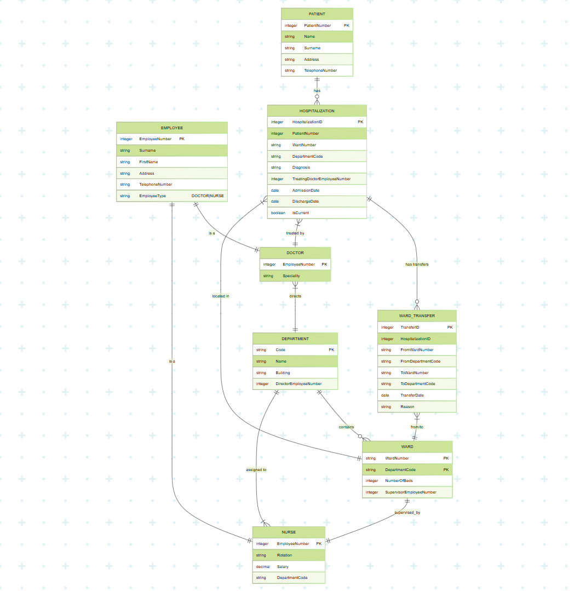

# Hospital Information System

A comprehensive JavaFX application for managing patient records in a hospital environment.

## Screenshot of the system(erd diaram and ui)

<



## Overview

This Hospital Information System is a desktop application built with JavaFX that allows hospital staff to manage patient records efficiently. The application follows a layered architecture pattern and provides a user-friendly interface for performing CRUD (Create, Read, Update, Delete) operations on patient data.

## Features

- **Patient Management**: Add, edit, and delete patient records
- **Data Validation**: Ensures all required fields are filled and properly formatted
- **Search Functionality**: Filter patient records based on search criteria
- **Modern UI**: Clean and intuitive user interface with responsive design
- **Database Integration**: PostgreSQL database for persistent storage of patient information

## Technical Stack

- **Frontend**: JavaFX with CSS styling
- **Backend**: Java
- **Database**: PostgreSQL
- **Architecture**: Layered architecture (Model, DAO, Service, Controller, View)
- **Build Tool**: Maven

## Project Structure

```
Hospital_info_System/
├── src/
│   ├── main/
│   │   ├── java/
│   │   │   └── com/
│   │   │       └── example/
│   │   │           └── hospital_info_system/
│   │   │               ├── config/         # Database configuration
│   │   │               ├── controller/     # UI controllers
│   │   │               ├── dao/            # Data Access Objects
│   │   │               ├── model/          # Data models
│   │   │               ├── service/        # Business logic
│   │   │               └── HelloApplication.java  # Main application class
│   │   └── resources/
│   │       └── com/
│   │           └── example/
│   │               └── hospital_info_system/
│   │                   ├── hello-view.fxml  # UI layout
│   │                   └── style.css        # CSS styling
└── pom.xml                                  # Maven configuration
```

## Installation and Setup

### Prerequisites

- Java Development Kit (JDK) 17 or higher
- Maven
- PostgreSQL database

### Database Setup

1. Create a PostgreSQL database named `Hospital_Infomanagement_System`
2. Use the following connection parameters:
   - URL: `jdbc:postgresql://localhost:5432/Hospital_Infomanagement_System`
   - Username: `postgres`
   - Password: `728728`

### Running the Application

1. Clone the repository
2. Navigate to the project directory
3. Run the following command:
   ```
   mvn clean javafx:run
   ```

## Usage

### Adding a Patient

1. Fill in the patient information in the form on the left side
2. Click "Add Patient" button
3. The patient will be added to the database and displayed in the table

### Editing a Patient

1. Select a patient from the table
2. Click the "Edit" button in the Actions column
3. Update the patient information in the dialog
4. Click "Save" to update the patient record

### Deleting a Patient

1. Select a patient from the table
2. Click the "Delete" button in the Actions column
3. Confirm the deletion in the confirmation dialog

### Searching for Patients

1. Type in the search field above the table
2. The table will automatically filter to show matching patients

## Future Enhancements

- User authentication and role-based access control
- Appointment scheduling
- Medical history tracking
- Reporting and analytics
- Dark mode theme

## License

This project is licensed under the MIT License - see the LICENSE file for details.

## Acknowledgements

- JavaFX community for the UI framework
- PostgreSQL for the database system
- Maven for build automation
